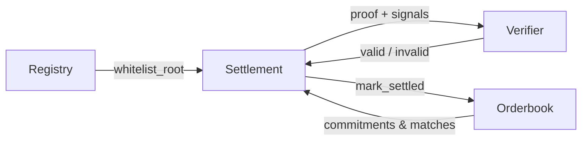

# DuskPool Architecture

Interactive architecture site for DuskPool: a privacy-preserving RWA darkpool protocol on Stellar, using Poseidon commitments and BN254 Groth16 proofs.

Live demo: https://duskpools.xyz/

## What This Repository Contains

- Scroll-driven walkthrough of the end-to-end trade lifecycle
- ZK circuit deep dive (inputs, constraints, outputs, and performance)
- Soroban contract architecture (Registry, Orderbook, Settlement, Verifier)
- Proof serialization layout for on-chain verification
- Animated system visuals for each phase

## Protocol Lifecycle (7 Steps)

1. KYC Onboarding
   - Off-chain KYC verification by trusted operator
   - Participant identity hash (`Poseidon(id_hash)`) inserted into on-chain Merkle tree
   - Tree depth is 20 (up to 1,048,576 participants)
2. Deposit to Escrow
   - Traders deposit assets into Settlement escrow
   - Balances tracked per `(participant, asset)`
   - Locked balances reserve funds for pending orders
3. Order Submission
   - Trader computes commitment:
   - `Poseidon(asset, side, qty, price, nonce, secret)`
   - On-chain order stores only commitment + minimal metadata (`asset`, `side`, `expiry`)
4. Order Matching
   - Matching engine validates full order preimages against on-chain commitments
   - Applies price-time logic, records match data on-chain
5. ZK Proof Generation
   - Off-chain prover generates Groth16 proof (BN254) with `snarkjs`
   - Proves whitelist inclusion, commitment validity, trade parameter consistency, and nullifier derivation
6. On-Chain Verification
   - Verifier computes `vk_x` from public signals
   - Checks Groth16 pairing equation via BN254 host functions
7. Atomic Settlement
   - Settlement enforces both signatures via `require_auth()`
   - Verifies proof, nullifier uniqueness, and whitelist root
   - Executes atomic escrow swap, then stores nullifier to prevent replay

## Privacy Model

Private data includes:

- Trader identity details and KYC documents
- Prices, quantities, nonces, and secrets
- Matching strategy details

Public data includes:

- Order commitment hashes
- Match metadata (commitments, quantity, execution price)
- Proof bytes, public signals, and whitelist root
- Nullifier hash and settlement record

## ZK Circuit Summary

- Proving system: Groth16 on BN254
- Approximate constraints: ~23,000
- Proof size: 256 bytes
- Public signals: 7 (`1 output + 6 inputs`)
- Merkle depth: 20
- Typical proving time: 30-60 seconds (off-chain)
- Typical verification time: 5-10 ms (on-chain)

Circuit constraints shown in the site:

1. Buyer whitelist membership
2. Seller whitelist membership
3. Buy commitment reconstruction
4. Sell commitment reconstruction
5. Nullifier derivation

## Canonical Poseidon Field Ordering

This protocol uses strict, canonical Poseidon field ordering across circuit, prover, and contracts.

```txt
Commitment: Poseidon([0] asset, [1] side, [2] qty, [3] price, [4] nonce, [5] secret)
Nullifier:  Poseidon([0] buyCommit, [1] sellCommit, [2] qty, [3] buySecret+sellSecret)
Merkle:     Poseidon([0] left, [1] right)
```

Commitments and nullifiers are stored as opaque values on-chain and are not recomputed by contracts.

## Smart Contracts (Soroban)

1. Registry (`darkpool_registry`)
   - Maintains participants and assets
   - Stores whitelist Merkle root
2. Orderbook (`darkpool_orderbook`)
   - Stores hidden order commitments and match records
3. Settlement (`darkpool_settlement`)
   - Manages escrow, nullifier checks, proof validation, and atomic swaps
   - Requires explicit buyer and seller authorization (`require_auth()`)
4. Verifier (`groth16_verifier_bn254`)
   - Stateless Groth16 verifier over BN254
   - Validates proof and public signals for Settlement

Cross-contract interaction:



## Proof Serialization

Proof bytes (256B):

- `pi_a.x`, `pi_a.y`
- `pi_b.x_c1`, `pi_b.x_c0`
- `pi_b.y_c1`, `pi_b.y_c0`
- `pi_c.x`, `pi_c.y`

Public signals bytes (228B):

- `signal_count` (4B)
- `nullifierHash`
- `buyCommitment`
- `sellCommitment`
- `assetHash`
- `matchedQuantity`
- `executionPrice`
- `whitelistRoot`

## Security Properties

- Layered authorization: signatures + valid ZK proof + nullifier uniqueness
- Atomicity: both balance transfers succeed together or fail together
- Replay protection: nullifier persisted after settlement
- Whitelist gating: settlement tied to on-chain whitelist root

## Tech Stack

- React 19 + TypeScript
- Vite 7
- Tailwind CSS 4
- beautiful-mermaid

## Local Development

```bash
pnpm install
pnpm dev
```

Build and preview:

```bash
pnpm build
pnpm preview
```
